# Chasing the Flush

A 3D mushroom-foraging game that runs in the browser. Version 1 is a single spring level: ten days of morel season in a Michigan hardwood woodland. Chase the flush, learn to tell true morels from the lookalikes that can make you sick, and fill the basket before the window closes.

**Play it: https://ncypher.github.io/chasing.the.flush/**

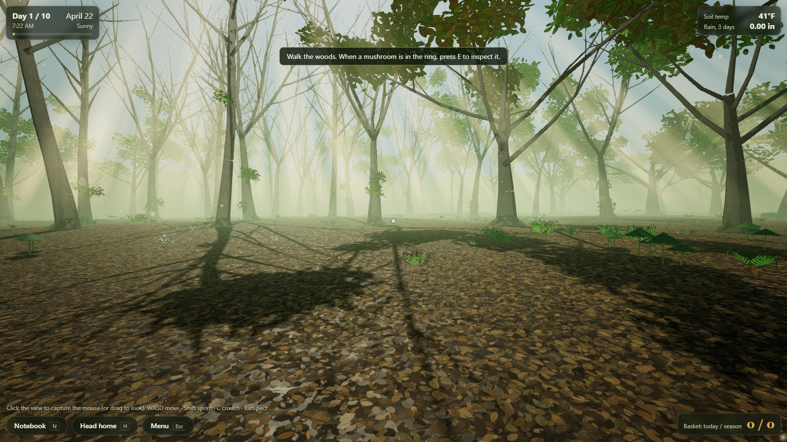

Everything is generated in code: terrain, trees, ferns, trillium, logs, light and the mushrooms themselves. There are no model, texture or audio files to download. The only dependency is [Three.js](https://threejs.org) 0.160.0, pinned to an exact version and loaded from jsDelivr. There is no build step.

## How to play

You have ten days. Each day is about 85 seconds of real time (7:00 AM to dusk).

1. **Read the weather.** The HUD shows soil temperature and the last three days of rain. They drive how many mushrooms fruit each day (see [the flush](#the-flush)).
2. **Walk the woods and spot mushrooms.** Morels favour the ground around dying elm and ash, old apple trees and tulip poplar. The open leaf-litter floor is mostly empty.
3. **Inspect.** When a mushroom is inside the target ring, press `E`. It comes up under a close-up lens where you can turn it over. Look at the cap surface, how the cap joins the stem, and the colour.
4. **Decide.** Pick it, leave it, or cut it in half. Cutting reveals the inside but destroys the mushroom.
5. **Mind the lookalikes.** A false morel in the basket makes you sick: you finish the day feeling ill and the *next* day is lost in bed. Leaving a true morel is only a missed opportunity.
6. After the tenth day the season ends and the summary shows true morels gathered, lookalikes avoided, mistakes and your best day.

A field notebook (`N`) keeps what you have learned. It records observations first and only labels a mushroom as true or false once you have confirmed it by cutting it open or picking it, so it never gives the answer away for free.

| | |
|---|---|
| 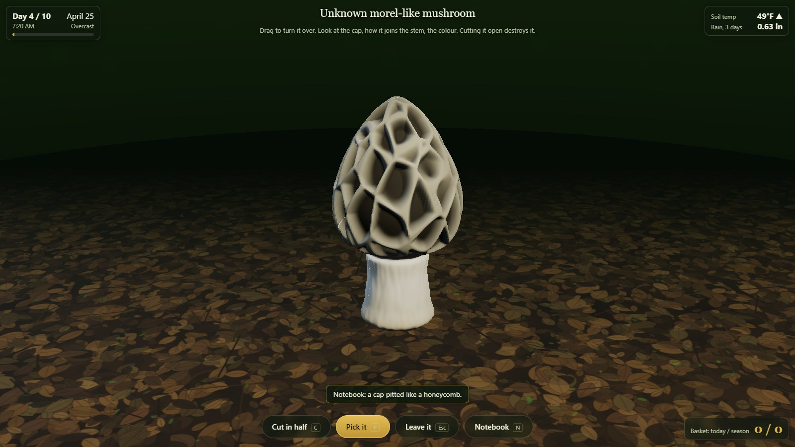 | 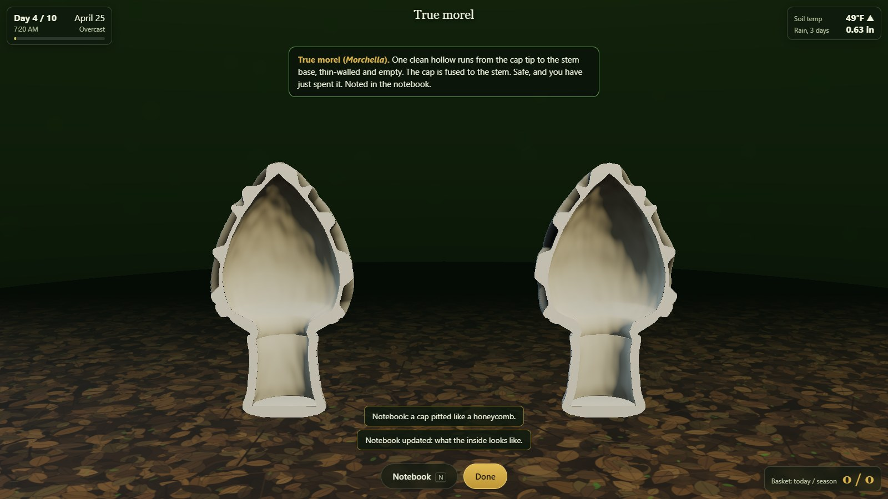 |
| Inspect: honeycomb of pits and ridges, cap fused to the stem | Cut open: one clean hollow from tip to base |
| 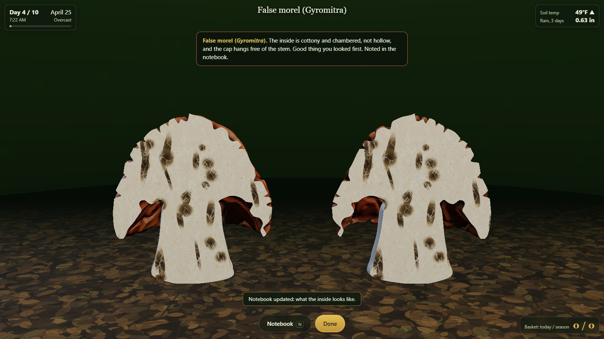 | 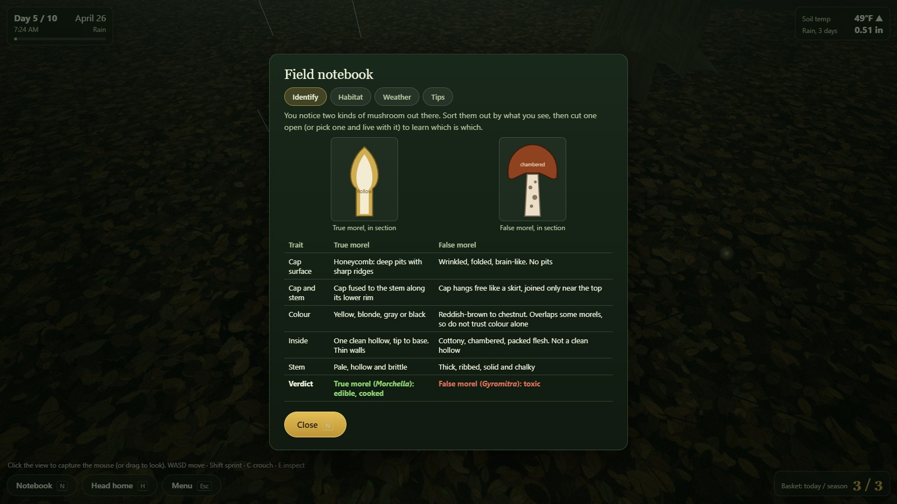 |
| Cut open a false morel: cottony, chambered, cap hanging free | Field notebook |

| | |
|---|---|
| 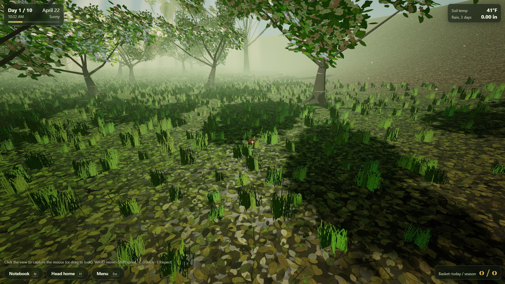 | 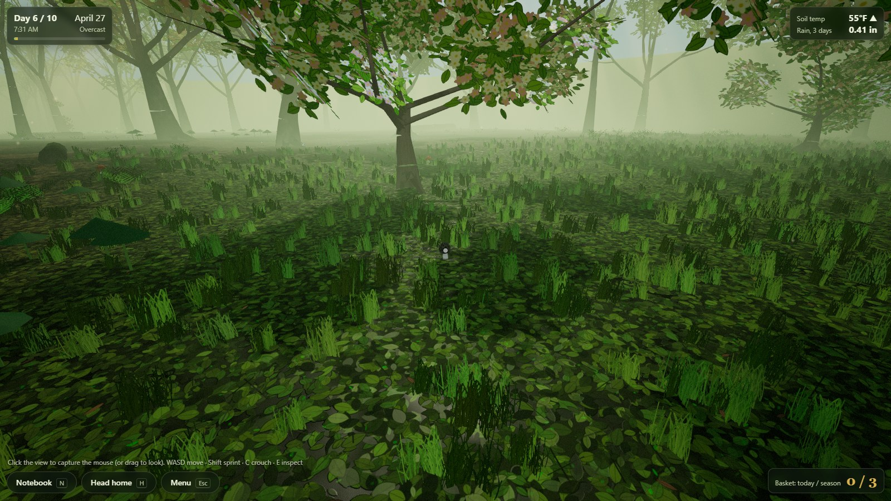 |
| Same orchard, day 1: only a few early lookalikes | Day 6: the flush is on |

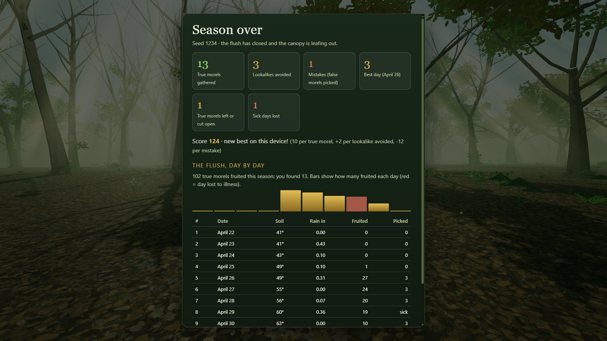

## Controls

| | Desktop | Phone / tablet |
|---|---|---|
| Move | `W` `A` `S` `D` or arrow keys | Left thumb: floating joystick |
| Look | Mouse (click the view to capture it); drag if capture is unavailable | Right thumb: drag |
| Sprint / crouch | `Shift` / `C` | Push the joystick all the way out to sprint |
| Inspect | `E` | **Inspect** button (appears when a mushroom is targeted) |
| In inspect view | Drag to turn, wheel to zoom, `C` cut, `P` pick, `Esc` leave | Drag to turn, on-screen buttons |
| Notebook | `N` | Notebook button |
| Head home (end the day early) | `H` twice, or the button | Head home button |
| Pause / menu | `Esc` (or the mouse leaving capture) | Menu button |

URL options: `?seed=1234` replays the same woods, weather and mushrooms. `?q=high|medium|low` pins a quality tier (otherwise it is picked automatically, and the pixel ratio adapts to the frame rate).

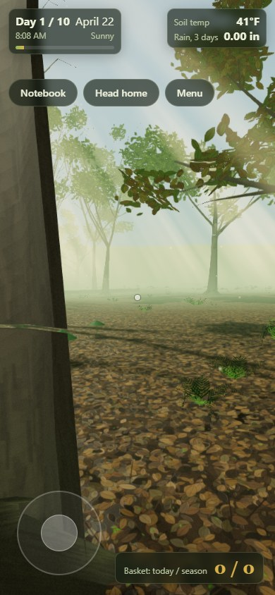 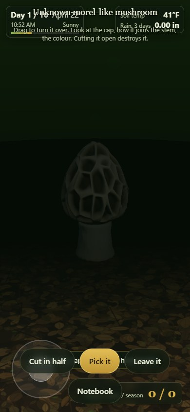 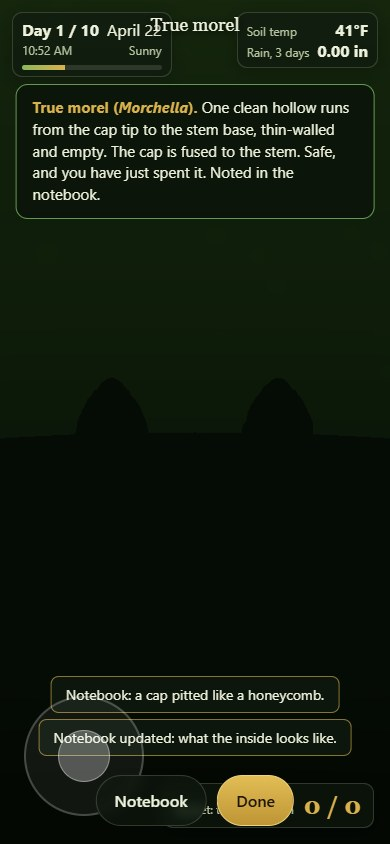

## The real mycology behind it

The game is a stylised version of real morel hunting. It is not an identification guide: never eat a wild mushroom because of anything you learned here.

- **When.** Morels (*Morchella*) fruit in spring when the soil a few inches down warms to roughly 50 °F (10 °C), usually after rain. In Michigan that is about late April into May. Fruiting stalls if the ground turns cold and winds down as it warms well past the 50s. The game compresses the window into ten days and drives it from soil temperature and recent rain.
- **Where.** In the eastern US morels are famously found around **dying elm** (Dutch elm disease) and **ash** (emerald ash borer), in **old apple orchards**, and under **tulip poplar**. The game weights its fruiting sites toward those hosts, with only a thin scatter on open ground.
- **True morel.** A cap covered in a honeycomb of pits and ridges, fused to the stem along its lower rim, and **hollow from the tip of the cap to the base of the stem** when sliced lengthwise. Cap colours range from yellow and blonde to gray and black.
- **False morel (*Gyromitra*).** A wrinkled, folded, brain-like cap, typically reddish-brown, that hangs free like a skirt and is joined to the stem near the top. Cut in half, the flesh is cottony or chambered rather than a clean single hollow. It contains gyromitrin, which the body converts to monomethylhydrazine, and eating it can cause serious illness. In the game it costs you a day. False morels tend to appear earlier, in cooler ground, so the first days are mostly lookalikes.
- **Cut it in half.** Slicing lengthwise is the standard field check, and it is the mechanic the game is built around. It is also why cutting one open destroys it.
- **Simplifications.** Real morels vary: "half-free" morels have a cap joined halfway up the stem, and *Verpa* (the early "false" morel) has a cap joined only at the tip and a stuffed stem. Neither is modelled. Colour overlaps between black morels and some *Gyromitra*, which is why the notebook warns against trusting colour. Mushrooms are drawn at about twice life size so you can spot them. Always cook morels thoroughly.

## The flush

The season is data, not code (`js/seasons/spring.js`). Each day has a soil temperature and rainfall from a seeded template. A species' **flush index** for a day is

```
flush(day) = tempFactor(soil at day-1) x moistureFactor(rain over the 3 days ending day-1)
```

`tempFactor` is a trapezoid (0 below the first temperature, ramps to 1, holds, ramps back to 0). `moistureFactor = 0.25 + 0.75 x min(1, rain3 / 0.7 in)`. The number of **new** mushrooms that day is `peakNew x flush x jitter`, drawn onto fruiting sites with a weighted draw, and each mushroom lasts three days.

| | True morel | False morel |
|---|---|---|
| Soil temperature trapezoid | 43 / 50 / 57 / 63 °F | 36 / 42 / 50 / 58 °F |
| Peak new mushrooms per day | 34 | 16 |
| Favoured hosts (site weight) | dying elm 3.4, dying ash 3.1, old apple 2.9, tulip poplar 2.3 | elm 1.7, ash 1.6, poplar 1.3, apple 0.9, open 0.55 |

Measured in a real play-through (seed 1234), the first column is the calendar day:

| Day | Soil | Rain (in) | Sky | New true | New false | True on the ground | False on the ground |
|---|---|---|---|---|---|---|---|
| 1 | 40.8 | 0 | sunny | 0 | 4 | 0 | 4 |
| 2 | 41.4 | 0.43 | rain | 0 | 4 | 0 | 8 |
| 3 | 43.2 | 0.10 | cloudy | 0 | 10 | 0 | 18 |
| 4 | 48.7 | 0.10 | cloudy | 1 | 12 | 1 | 26 |
| 5 | 49.4 | 0.31 | rain | 27 | 15 | 27 | 37 |
| 6 | 55.1 | 0 | cloudy | 24 | 15 | 48 | 42 |
| 7 | 56.0 | 0.07 | sunny | 20 | 4 | 65 | 34 |
| 8 (sick day) | 60.4 | 0.36 | rain | 19 | 3 | 63 | 22 |
| 9 | 62.8 | 0 | cloudy | 10 | 0 | 49 | 7 |
| 10 | 66.0 | 0 | sunny | 1 | 0 | 30 | 3 |

The flush starts around day 4, peaks on days 5 to 8 and closes by day 10 as the soil passes the high 50s. Day 8 was lost to a false morel picked on day 7, and the woods went on without the player.

## Architecture

```
index.html, css/style.css
js/
  main.js                 boot, render loop, input wiring, quality tiers
  core/                   seeded RNG (mulberry32, forkable), Perlin/Worley noise, helpers
  seasons/                season registry + spring.js (pure data: weather, species, habitat)
  game/                   season.js (weather + flush model), spawner.js (habitat sites and
                          daily draw), game.js (day clock, picking, sickness, notebook, tally)
  mushrooms/              lathe.js (revolve + cut halves), morel.js, gyromitra.js, index.js
  world/                  terrain, trees, plants, atmosphere (fog, sky, shafts), textures
    environments/spring.js   the spring environment module
  controls/               desktop + touch first-person controls
  render/post.js          bloom, vignette + colour grade, SMAA/FXAA
  ui/                     HUD, notebook, overlays (ui.js) and the 3D inspect view (inspect.js)
tools/                    dev server, Playwright end-to-end verification, mushroom gallery
docs/screenshots/         screenshots used here (produced by tools/verify.mjs)
```

Seeded RNG: every subsystem forks its own stream from the run seed, so a seed always replays the same terrain, trees, weather and daily emergence.

**Adding a season** (summer chanterelles and black trumpets, fall maitake) takes two files and one registry line, and the core stays untouched:

1. `js/seasons/summer.js`: a config like `spring.js` with the weather template, the species and their flush curves, habitat weights and the `loadEnvironment` import.
2. `js/world/environments/summer.js`: an environment module returning the same shape as the spring one: `{ group, heightAt, hostTrees(), canSpawn(), collide(), update(), setWeather(), setTimeOfDay(), start, fog, ... }`. Trees tag themselves with a `host` string, and the species' `habitat.weights` refer to those strings.
3. Register it in `js/seasons/index.js`, and add the new species' geometry factory to `SPECIES_BUILDERS` in `js/mushrooms/index.js`. A factory only has to return an outline profile, optional hollow and a shading function.

## How the look is made

- **Mushrooms.** A lathe (solid of revolution) of a spline outline. True morel caps are displaced with cellular noise to cut a pit-and-ridge honeycomb, with pits darkened in the vertex colours. False morel caps use domain-warped noise for brain-like folds and lobes. Each variant gets its own seeded proportions, palette and pit scale, and every instance is scaled, leaned and rotated. The cut view builds exact half-profiles, so the hollow cavity and the chambered flesh are real geometry and not a texture trick.
- **Light.** One shadow-mapped sun (texel-snapped so shadows do not shimmer), a hemisphere light and a faint sky reflection. Canopy leaf cards are alpha-tested so they cast real dappled shadows. Light shafts are additive billboards placed only where the canopy has a gap along the sun ray.
- **Atmosphere.** Height-aware exponential fog (thicker near the ground), a sky dome, drifting motes, and weather states that dim the sun, thicken the fog, wet the litter and bring rain on rainy days.
- **Post.** Quarter-resolution bloom, a gentle colour grade with vignette and grain, tone mapping, then SMAA. The poisoned state adds a wobble and green wash.

## Performance

Measured by `tools/verify.mjs` on a laptop with an **Intel Arc 140T integrated GPU** in Microsoft Edge, default settings (the `high` tier: shadow map 2048, bloom, SMAA, about 14,000 litter leaves), walking and turning for 8 seconds:

| Viewport | Frame rate | Average frame | 95th percentile |
|---|---|---|---|
| 1280 x 720 | **60.0 fps** | 16.67 ms | 16.8 ms |
| 1920 x 1080 | **60.0 fps** | 16.67 ms | 16.8 ms |
| 390 x 844 phone emulation, DPR 3, `low` tier (pixel ratio clamped to 1.25) | 60.0 fps | 16.67 ms | 16.8 ms |

These readings are pinned at the 60 Hz display refresh, so they show the game is not dropping frames. They do not show how much headroom is left. Phones were tested only through browser emulation on the same GPU, not on real devices. An earlier build used 4x MSAA on the HDR buffer and ran at 43 fps at 1080p on this GPU, which is why antialiasing is now a post pass. If the frame rate falls under about 40 fps the game lowers its pixel ratio automatically.

## Running and testing locally

```bash
npm install            # only needed for the test tooling (playwright-core)
npm run serve          # static server on http://127.0.0.1:8080
npm run verify         # end-to-end run in a real browser (Microsoft Edge by default)
```

The game itself needs no install: any static file server works, and it is deployed straight from the `main` branch root on GitHub Pages. `npm run verify` plays a full ten-day season through the real UI (title screen, inspecting, cutting, picking, a deliberate false-morel mistake, the lost day, the dusk timer and the summary), compares the summary screen with its own tally, checks the console on desktop and a phone-sized touch viewport, measures the frame rate, and rewrites `docs/screenshots`. Set `BASE_URL` to check a deployed copy, and `BROWSER_CHANNEL` (for example `chrome`) to use another browser. `tools/gallery.html` renders every mushroom variant side by side for debugging.

## Deploying

GitHub is the source of truth. The game is published to two places from the same files:

| Target | URL | How it updates |
|---|---|---|
| GitHub Pages | https://ncypher.github.io/chasing.the.flush/ | Automatic: pushing to `main` publishes the repo root |
| Hugging Face Space (static mirror) | https://huggingface.co/spaces/Strange-Loop/chasing.the.flush, direct play at https://strange-loop-chasing-the-flush.static.hf.space/ | Manual: `npm run deploy:hf` |

`npm run deploy:hf` (`scripts/deploy-hf.mjs`) copies only what the game needs to run (`index.html`, `css/`, `js/`) into a temporary staging folder, adds a Space-specific `README.md` with the Hugging Face frontmatter, commits it on top of the Space's `main` and pushes to the `hf` remote. Add `-- --dry` to stage without pushing. The Space frontmatter lives only in that script, not in this README.

One-time setup: `git remote add hf https://huggingface.co/spaces/Strange-Loop/chasing.the.flush`, and give git a Hugging Face access token with write access to the Space (git will prompt for it once and Git Credential Manager remembers it). Never put the token in a file or on a command line.

## What v1 leaves out

- One level only: spring. Summer and fall are designed for (see above) but not built.
- No rival foragers, no audio, no save game. Only an optional best score is kept, in `localStorage`, wrapped in `try/catch`.
- Simplified biology: a ten-day window, two species, and the morel and *Gyromitra* variants described above.
- Occlusion is not tested when targeting a mushroom, so one just behind a fern can still be inspected.

Built with [Three.js](https://threejs.org) (MIT).

